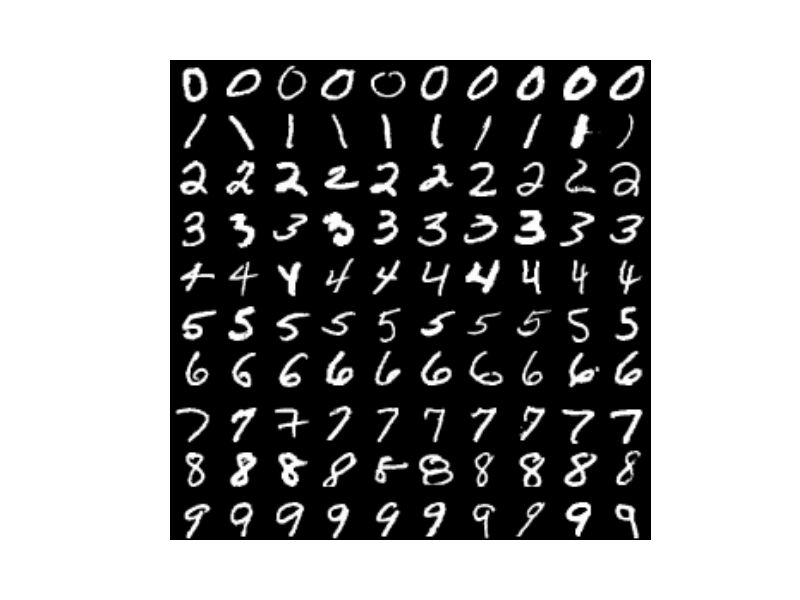
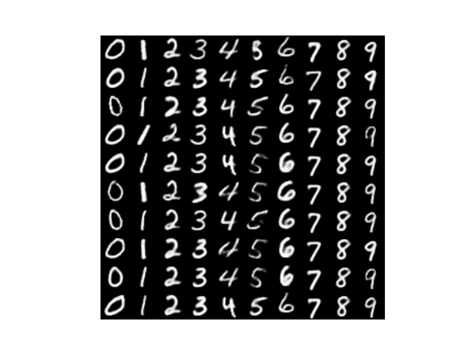
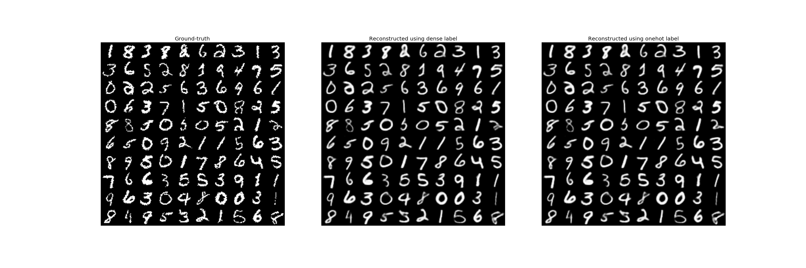

# Categorical VAE (using Gumbel-Softmax approximation) in Tensorflow

Implementation (with modifications) of [*Categorical Reparameterization 
with Gumbel-Softmax*](https://arxiv.org/abs/1611.01144)  
Modifications:
  1. Batch Norm
  2. ConvNet specifications
  3. alpha value
  4. temperature: 
  	Eric: tau = max(0.5, exp(-r*t)), t is step, r = {1e-5, 1e-4}
  	Mine: tau = tau0 + (1 - tau0) exp(-r*t), t is epoch, r ~ 2.7e-4
  4. (more?)

<br/>
<br/>

## Semi-supervised learning for MNIST dataset
Classification results on the test set
Error rate: ~ 3 - 8% (depending on the configs)  
Confusion matrix:  

|       |   0|   1|   2|  3|   4|   5|   6|   7|   8|   9|
|-------|----|----|----|---|----|----|----|----|----|----|
| **0** | 971|   0|   2|  0|   0|   1|   1|   1|   4|   0|
| **1** |   0|1112|  12|  0|   0|   4|   3|   1|   3|   0|
| **2** |   1|   0|1005|  1|   3|   0|   0|   7|  14|   1|
| **3** |   1|   0|  23|930|   1|  36|   0|   4|  15|   0|
| **4** |   1|   0|   7|  0| 950|   0|   2|   0|   2|  20|
| **5** |   6|   0|   2| 13|   0| 853|   2|   0|  14|   2|
| **6** |  11|   1|   3|  0|   1|   7| 931|   0|   3|   1|
| **7** |   2|   2|  23|  0|   9|   1|   0| 980|   2|   9|
| **8** |   4|   0|   8|  2|   3|   2|   1|   2| 950|   2|
| **9** |   6|   0|   5| 20|   8|   1|   0|   4|   9| 956|
<br/>
<br/>


### 100 labeled images (Training set)
  
Ten images per class.  
<br/>
<br/>

### Style Change (Testing set)
  
Row: same style across 10 classes.  
Style is obtained from the diagonal image.
<br/>
<br/>

### Reconstruction (Testing set)
  
Reconstruction using the inferred class label.  
 - Left: Input (Ground-truth)
 - Middle: using inferred dense label.
 - Right: using inferred discrete label.
<br/>
<br/>

### Environment and Dependency
- Linux Ubuntu 16.04
- Python 3.5
- Tensorflow 0.12
- Matplotlib
- sklearn
- Numpy
- Json

<br/>

### Usage
Git clone this repo.  
Download and unzip MNIST to a sub-folder `dataset`  
Specify your configurations in `architecture.json`, and execute `python train.py`  
<br/>
Or equivalently, run the following script.  
```bash
git clone https://github.com/JeremyCCHsu/Gumbel-Softmax-VAE-in-tensorflow.git
cd Gumbel-Softmax-VAE-in-tensorflow
mkdir dataset
cd dataset
curl http://yann.lecun.com/exdb/mnist/train-images-idx3-ubyte.gz -o train-images-idx3-ubyte.gz
gzip -d train-images-idx3-ubyte.gz
curl http://yann.lecun.com/exdb/mnist/train-labels-idx1-ubyte.gz -o train-labels-idx1-ubyte.gz
gzip -d train-labels-idx1-ubyte.gz
curl http://yann.lecun.com/exdb/mnist/t10k-images-idx3-ubyte.gz -o t10k-images-idx3-ubyte.gz
gzip -d t10k-images-idx3-ubyte.gz
curl http://yann.lecun.com/exdb/mnist/t10k-labels-idx1-ubyte.gz -o t10k-labels-idx1-ubyte.gz
gzip -d t10k-labels-idx1-ubyte.gz
cd ..
python train.py
```

